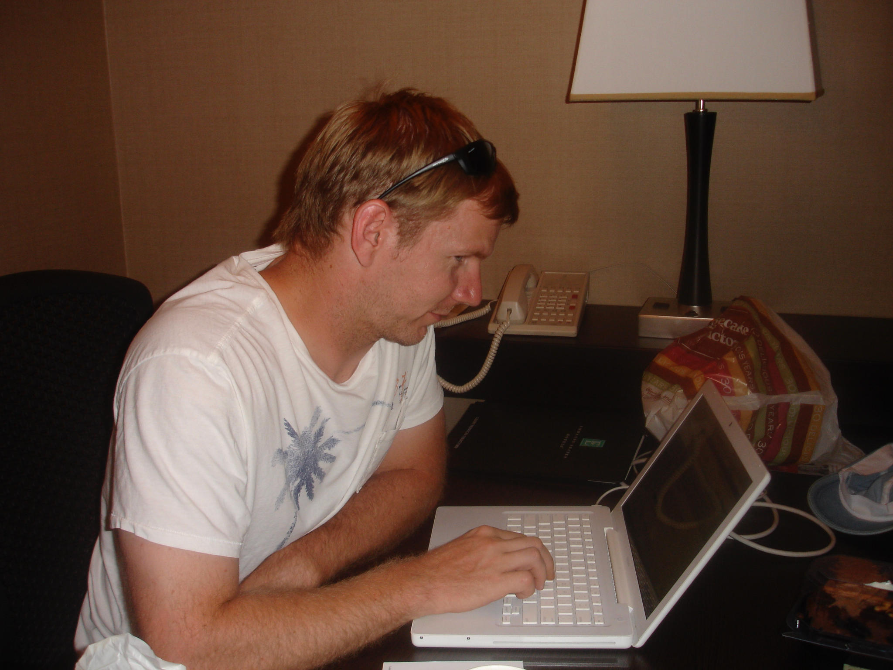

> "If we have a blog, we must have an 'About Me' page" ~ unknown

Hi, I'm Scott Wysocki and I'm a software developer. I mainly write automation
that removes the boring parts of developers' jobs. Normally, I am a full-time employee 
of companies in the Cloud Computing space where I build tools and applications that help
programmers get things done. 

I've worked for over a decade in various roles from IT to
Software Engineering.  I started my journey in networking; configuring and troubleshooting
routers and switches for the Department of Defense.  I eventually obtained my Bachelor's
degree and transitioned into software development where I fell in love with the creation
of tools, utilities, and automation.

I also run [www.box76.com](https://www.box76.com) where I get to scratch my itch as a
creator. I adore tinkering, fixing, and making things that don't exist yet.  I'm enamored
with modern manufacturing techniques and love the ability to design and build useful
products at home.  I believe we are living in the future and innovations like 3D printers,
home CNC machines, and laser cutters have changed manufacturing forever.

If any of these topics excite you too, feel free to contact me.  You may be able to find
me on Social Media, but the most direct route is email.